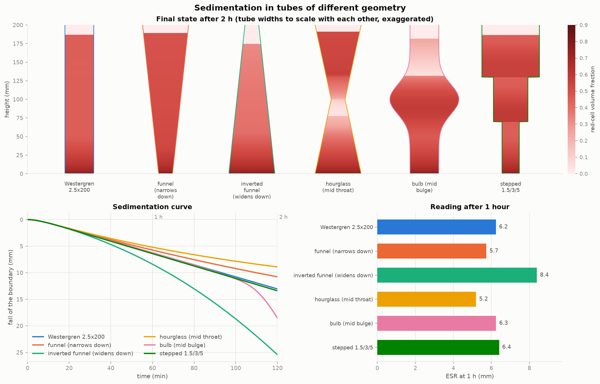

# bloodsed — شبیه‌سازی ته‌نشینی خون در لوله‌هایی با هندسه‌ی متفاوت

شبیه‌ساز سرعت ته‌نشینی گلبول قرمز (ESR) که هندسه‌ی لوله را به‌عنوان بخشی از
فیزیک مسئله در نظر می‌گیرد: لوله‌ی استوانه‌ای، مخروطی، ساعت‌شنی، حبابی،
پله‌ای، پروفیل دلخواه، و لوله‌ی کج‌شده.

*(English documentation follows below — [English](#english).)*

## چرا هندسه مهم است

معادله‌ی بقای حجم گلبول‌ها در لوله‌ای با سطح مقطع متغیر `A(z)` این است:

```
∂(A·φ)/∂t = ∂(A·f(φ))/∂z
```

که `φ` کسر حجمی گلبول قرمز و `f(φ)` شار ته‌نشینی است. جمله‌ی `f(φ)·A'(z)/A(z)`
در لوله‌ی استوانه‌ای صفر است ولی در بقیه‌ی هندسه‌ها نه:

* لوله‌ای که **به سمت پایین تنگ می‌شود** گلبول‌ها را **متراکم** می‌کند →
  ته‌نشینی کندتر می‌شود.
* لوله‌ای که **به سمت پایین گشاد می‌شود** سوسپانسیون را **رقیق** می‌کند →
  ته‌نشینی شتاب می‌گیرد.
* گلوگاه (ساعت‌شنی) کل ستون را خفه می‌کند و زیر خودش ناحیه‌ی رقیق می‌سازد.



## نصب

```bash
git clone https://github.com/ariyangoli123/Rrr.git
cd Rrr
pip install -e .          # numpy و matplotlib را نصب می‌کند
pytest -q                 # ۱۲۸ تست
```

## استفاده‌ی سریع

```bash
bloodsed list                                   # هندسه‌ها و نمونه‌های آماده
bloodsed run westergren --hours 2 --out results
bloodsed compare shapes --out results           # نمودار مقایسه‌ای بالا
bloodsed compare tilt --hours 1                 # اثر بویکات (لوله‌ی کج)
bloodsed sweep hematocrit 0.2,0.3,0.45,0.6 --out results
bloodsed run "cone:L=200,Dbot=1.2,Dtop=4" --blood inflammation
```

از پایتون:

```python
from bloodsed import BloodProperties, SimulationConfig, get_geometry, simulate

blood  = BloodProperties(hematocrit=0.45, aggregate_diameter_um=60)
result = simulate(get_geometry("westergren"), blood, SimulationConfig(duration_h=2))

print(result.esr(1.0))     # ESR یک‌ساعته بر حسب میلی‌متر
print(result.esr(2.0))
```

### هندسه‌ها

| نام | توضیح |
|---|---|
| `westergren`, `wintrobe`, `micro`, `wide` | لوله‌های استاندارد آزمایشگاهی |
| `funnel` / `inverted-funnel` | مخروطی، تنگ‌شونده / گشادشونده به سمت پایین |
| `hourglass`, `waist` | گلوگاه میانی |
| `bulb` | برآمدگی میانی |
| `stepped`, `conical-tip` | مقطع پله‌ای |
| `westergren-tilt3`, `westergren-tilt15` | لوله‌ی کج‌شده |

هندسه‌ی دلخواه با رشته‌ی مشخصات:

```
cylinder:L=200,D=2.5
cone:L=200,Dbot=1.2,Dtop=4
hourglass:L=200,Dend=4,Dthroat=1,at=0.5
bulb:L=200,D=2.5,Dbulge=6,pos=0.5,width=0.1
stepped:20x1,180x3
هر کدام + ,tilt=3   →   لوله‌ی کج
```

یا از روی جدول اندازه‌گیری‌شده / تابع دلخواه:

```python
from bloodsed import Profile, FunctionTube
tube = Profile(heights_mm=[0, 6, 12, 100], diameters_mm=[1, 4, 8, 8])
tube = FunctionTube(100, lambda z: 4 + 1.6 * np.sin(2 * np.pi * z / 20))
```

### نمونه‌های خون

`normal`، `normal-female`، `anemic`، `polycythemic`، `inflammation`،
`severe-inflammation`، `newborn` — یا هر ترکیبی از هماتوکریت، قطر رولو،
گران‌روی پلاسما و حد تراکم.

## روی گوشی (اندروید)

نسخه‌ی وب تعاملی: همان حل‌گر به JavaScript پورت شده و در مرورگر گوشی اجرا می‌شود.
لوله را انتخاب می‌کنید، اسلایدرها را می‌کشید و نتیجه بلافاصله به‌روز می‌شود.

```bash
cd web && python3 -m http.server 8000     # سپس در گوشی: http://<ip-کامپیوتر>:8000
```

برای نصب روی گوشی: صفحه را در کروم باز کنید و از منو **Add to Home screen** را بزنید.
با service worker آفلاین هم کار می‌کند. برای انتشار عمومی، workflow آماده‌ی
`.github/workflows/pages.yml` پوشه‌ی `web/` را روی GitHub Pages منتشر می‌کند
(کافی است در Settings → Pages منبع را روی GitHub Actions بگذارید).

یک نسخه‌ی تک‌فایلی هم ساخته می‌شود (`python3 web/build_single.py`) که می‌توانید
`web/dist/standalone.html` را مستقیم به اشتراک بگذارید.

**درستی پورت JS تضمین‌شده است:** `node web/test_sim.mjs` نتایج جاوااسکریپت را با
مقادیر مرجعِ تولیدشده از مدل پایتون برای ۱۵ حالت مقایسه می‌کند (خطای مجاز ۱e-۴
برای لوله‌ی قائم) و آزمون‌های حل بسته را هم تکرار می‌کند — ۹۱ بررسی.

## خروجی‌ها

* `comparison.png` — شکل لوله‌ها + منحنی‌های ته‌نشینی + ESR یک‌ساعته
* `case_*.png` — نمای لوله در چند زمان، منحنی، و نقشه‌ی غلظت (ارتفاع × زمان)
* `summary.csv`, `curve_*.csv`, `profiles_*.csv`
* GIF متحرک با `--animate`

## اعتبارسنجی

مدل در برابر هر چیزی که جواب بسته دارد آزموده شده است:

| بررسی | نتیجه |
|---|---|
| بقای حجم گلبول‌ها | خطای نسبی `< ۱e-۱۲` |
| `0 ≤ φ ≤ φ_max` در همه‌ی هندسه‌ها | برقرار |
| سرعت شوک کینچ `u₀(1−φ₀/φ_max)ⁿ` | خطای `< ۱e-۵` |
| استقلال از شبکه (۲۰۰ تا ۱۶۰۰ سلول) | تا ۶ رقم بامعنا یکسان |
| ESR نمونه‌ی نرمال در وسترگرن | ≈ ۶ mm/h (محدوده‌ی بالینی) |
| کج‌کردن ۳ درجه | ≈ ۴۰٪ افزایش (قاعده‌ی سرانگشتی بالینی ~۳۰٪) |

جزئیات کامل مدل، فرضیه‌ها، محدودیت‌ها و مراجع: [`docs/physics.md`](docs/physics.md).

---

<a name="english"></a>

# bloodsed — blood sedimentation in tubes of different geometry

A simulator for the erythrocyte sedimentation rate (ESR) that treats the shape
of the tube as part of the physics rather than as a detail of the apparatus.

## Why geometry matters

Cell volume in a tube of varying cross-section `A(z)` obeys

```
d/dt [ A(z) phi ]  =  d/dz [ A(z) f(phi) ]
```

The extra term `f(phi) A'(z)/A(z)` is zero only in a straight tube:

* a tube that **narrows downward** concentrates the cells, and a denser
  suspension settles more slowly;
* a tube that **widens downward** dilutes them, and the boundary accelerates;
* a throat throttles the whole column and leaves a dilute zone beneath it.

## Install

```bash
pip install -e .
pytest -q
```

## Use

```bash
bloodsed list
bloodsed run westergren --hours 2 --out results
bloodsed compare shapes --out results
bloodsed compare westergren,westergren:tilt=3,westergren:tilt=15
bloodsed sweep hematocrit 0.2,0.3,0.45,0.6 --out results
bloodsed compare --scenario examples/scenario.yaml --out results
```

```python
from bloodsed import BloodProperties, SimulationConfig, get_geometry, simulate

result = simulate(get_geometry("westergren"),
                  BloodProperties(hematocrit=0.45),
                  SimulationConfig(duration_h=2.0))
print(result.esr(1.0), "mm in the first hour")
```

Run `bloodsed list` for the built-in tubes, samples and flux laws, and see
`examples/` for five worked scripts (single tube, geometry comparison, tilted
tube, custom profiles, hematocrit sweep).

## On a phone

`web/` is an interactive browser build: the same solver ported to JavaScript, so
it runs on an Android phone with no toolchain. Pick a tube, drag the sliders,
watch the boundary fall.

```bash
cd web && python3 -m http.server 8000     # then open http://<your-ip>:8000 on the phone
node web/test_sim.mjs                     # 91 checks, incl. agreement with the Python model
python3 web/build_single.py               # -> web/dist/standalone.html, one shareable file
```

Chrome's **Add to Home screen** installs it; a service worker keeps it working
offline. `.github/workflows/pages.yml` publishes `web/` to GitHub Pages once
Pages is set to build from GitHub Actions.

The JavaScript port is held to the Python model by
`web/make_fixtures.py` -> `web/fixtures.json` -> `node web/test_sim.mjs`: fifteen
geometry/sample/tilt combinations must agree to 1e-4 for upright tubes, plus the
same closed-form checks the Python suite runs.

## How it works

Kynch's conservation law for batch sedimentation, extended with a variable
cross-section, discretised with finite volumes and the exact Godunov flux in
supply/demand form. Hindered settling follows Richardson-Zaki with a packing
limit; rouleaux formation enters as a lag on the Stokes velocity; tube-wall
drag uses the Faxen factor at the local diameter; tilted tubes use a
calibrated Ponder-Nakamura-Kuroda enhancement.

The scheme is monotone and conservative: cell volume drifts by ~1e-16 relative,
`phi` stays inside `[0, phi_max]`, and the hindered settling front reproduces
the analytic Kynch shock speed to five decimal places, independent of the mesh.

Full model, assumptions, limitations and references: [`docs/physics.md`](docs/physics.md).

## Layout

```
bloodsed/
  blood.py        sample properties, Stokes velocity, rouleaux lag
  geometry.py     tube shapes, presets, spec strings, exact volumes
  flux.py         hindered settling laws + Godunov supply/demand flux
  inclination.py  Boycott / PNK model for tilted tubes
  solver.py       finite-volume solver, sub-cell boundary tracking
  metrics.py      ESR, Katz index, lag, sediment, CSV export
  plotting.py     figures (curves, concentration maps, tube snapshots)
  cli.py          run / compare / sweep / list
docs/physics.md   the model, its verification and its limits
examples/         five runnable scripts and a scenario file
tests/            128 tests, including the closed-form checks
web/              browser build: sim.js (the solver), app.js (the instrument),
                  PWA manifest and service worker, cross-language tests
```

## Licence

MIT.
